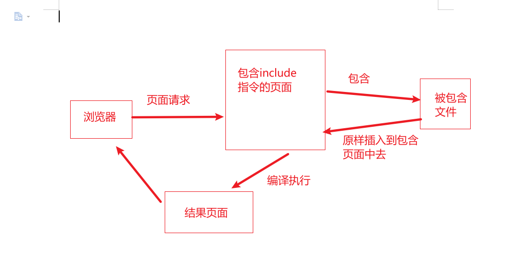

# JSP
## 1.JSP概述
### 1.1 概述
- 概述

>JSP页面中，可以包含指令标识、HTML代码、JavaScript代码、嵌入的Java代码、
注释和JSP动作标识等内容。
JSP 全名为 Java Server Pages，java 服务器页面。JSP 是一种基于文本的程序，其特点就是 HTML
和 Java 代码共同存在！

- why

>JSP 是为了简化 Servlet 的工作出现的替代品，Servlet 输出 HTML 非常困难，JSP 就是替代
Servlet 输出 HTML 的。

- 原理

JSP本质上就是一个Servlet.
Tomcat 访问任何的资源都是在访问 Servlet！，JSP 也不例
外！JSP 本身就是一种 Servlet。JSP 在第一次被访问的时候会被编译为 HttpJspPage 类
（该类是 HttpServlet 的一个子类）

- jsp编译过程

浏览器第一次请求 .jsp 时，Tomcat 会将 .jsp 转化成 .java 这么一
个类，并将该文件编译成 class 文件。编译完毕后再运行 class 文件来响应浏览器的请求。
以后访问 1.jsp 就不再重新编译 jsp 文件了，直接调用 class 文件来响应浏览器。当然了，如果
Tomcat 检测到 JSP 页面改动了的话，会重新编译的。

- 生命周期

JSP 也是 Servlet，运行时只有一个实例，JSP 初始化和销毁时也会调用 Servlet 的 init()和
destroy()方法。另外，JSP 还有自己初始化和销毁的方法

 `public void _jspInit() {
 _el_expressionfactory = _jspxFactory.getJspApplicationContext(getServletConfig().ge
tServletContext()).getExpressionFactory();
 _jsp_instancemanager = org.apache.jasper.runtime.InstanceManagerFactory.getInstance
Manager(getServletConfig());
 }
 public void _jspDestroy() {
 }`

### 1.2 指令标识
- 指令标识: 
>设定整个JSP页面范围内都有效的向相关信息，它是被服务器解释并执行的，不会产生任何内容到网页中。

- 语法格式:       
`<%@ 指令名 属性1=”属性值1“ ... %> `     

- 参数说明:
    - 指令名：指令名称 JSP中有page、include、taglib三条指令
    - 属性：属性名称，不同指令有不同的属性。一个指令中可以有多个属性，用空格分割。
    - 属性值：指定属性值
    
- eg   
<%@ page language="java" contentType="text/html;charset=utf-8" pageEncoding="utf-8">

- 注意    
> <%@ 和 %> 是完整的标记，不能添加空格，但是标签中定义的属性与指令名之间是有空格的

**1.page指令**  
>JSP中常用指令，用于定义整个JSP页面的相关属性      
- 语法 
```jsp
<%@ page 属性1=”属性值1“ ... %>
```   

- 属性:
    - language:用于设置JSP页面使用的语言
    - extend: 设置JSP页面继承的类。
    - import:设置JSP导入的包
    - pageEncoding:指定编码格式，即文件文件编码
    - contentType:设置JSP页面的MIME类型和字符编码，浏览器会据此显示网页内容。
    - session:指定JSP页面是否使用HTTP的session会话对象，其属性值是Boolean类型，true：可以使用session；false：不能使用session
    - buffer:设置JSP的out输出对象使用的缓冲区大小，默认为8KB,单位只能使用KB
    - autoFlush:设置是否自动刷新缓存
    - isErrorPage:设置JSP页面为错误处理页面，。以处理另外一个JSP页面的错误，就是异常处理。意味着JSP页面业务的改变。
    - errorPage:用于指定当前页面的异常错误的另一个JSP页面，被指定的JSP页面的isErrorPage属性值必须被设置为true
    
```jsp
<%@ page language="java"
         import="java.util.Date"
         import="java.text.SimpleDateFormat"
         pageEncoding="utf-8"
         contentType="text/html;charset=UTF-8"
         session="false"
         buffer="128KB"
         autoFlush="true"
         isErrorPage="false"
         errorPage="index.jsp"
%>
<html>
<head>
    <title>显示系统当前时间</title>
</head>
<body>
<%
    Date date = new Date();
    SimpleDateFormat df = new SimpleDateFormat("yyyy-MM-dd HH:mm:ss");
    String today = df.format(date);
%>
<h1>当前时间:<%=today%></h1>
</body>
</html>

```

**2.include指令**
>使用include指令可以在一个JSP页面中包含另外一个JSP页面，但是该指令是静态包含，被包含的JSP页面内容会被原样包含到该JSP中，即使被包含页面中有JSP代码，在包含的时候不会被编译执行。
>使用include指令，最终将生成一个文件，所以在被包含的文件中，不能有相同名称的变量。



- 语法
```jsp
<%@ include file="path"%>
```
- 属性
    - file:指定包含文件的路径

- 说明
>使用include指令包含文件可以大大提代码的重用性，也便于维护和升级

**3.taglib指令**
>在JSP中，使用taglib指令标识声明该页面中使用的标签库，同时引入标签库，并指定标签的前缀。

- 语法
```jsp
<%@ taglib prefix="tagPrefix" url="tagURI"%>
```
- 参数
    - prefix:用于指定标签前缀
    - uri:指定标签库文件的存放位置

- 在文件中引入JSTL的核心标签库
```jsp
<$@ taglib prefix="c" yri="http://java.sun/jsp/jstl.core"%>
```

### 1.3 脚本标识
>JSP定义Java的方式

**1.JSP表达式**
>定义的Java代码，会输出到页面上。输出语句可以定义什么，这个地方就可以定义什么
```jsp
<%= 表达式 %>  
表达式：可以是任何Java语言的完整表达式，但是“=”与后面的表达式可以有空格
```

**2.声明标识**
>定义的Java代码，在JSP转换成Servlet后，在成员属性位置。用的比较少，因为在servlet中尽量少定义变量，避免线程安全问题。
```jsp
<%! 声明变量或者方法的代码 %>
```

**3.代码片段**
```jsp
<% Java代码或者是脚本代码 %>
```

### 1.4 JSP注释
1.HTML中的注释
```jsp
 <%-- 注释内容 --%>
```
2.带有JSP表达式的注释
```jsp
<%-- 注释内容 --%>
```

3.隐藏注释      
`<%-- 注释内容 --%>`


### 1.5 动作标识
1.包含文件标识`<jsp:include>`

2.请求转发标识`<jsp:forward>`

3.参数传递标识`<jsp:param>`

## 2.JSP内置对象
### 2.1内置对象概述
>JSP提供了由容器提供和管理的内置对象，也可以称之为隐含对象，这些内置对象不需要
通过JSP页面来编写来实例化，在所有的JSP页面中可以直接使用，，它们起到了简化页面
的作用。JSP内置对象被广泛应用于JSP的各种操作中。

>由于JSP使用Java作为脚本语言，所以JSP具有强大的对象处理能力，并且可以动态创建
Web页面内容，但是Java语言在使用一个对象之前，需要先实例化这个对象，这种用法
在JSP中比较繁琐。为了简化开发，JSP提供了一些内置对象，用来实现很多JSP应用，
在使用JSP内置对象的时候，不需要实例化，直接使用就行。

>在JSP中，一共预先定义了九个对象，分别是：
- request----------HttpServletRequset
>一次请求访问的多个资源（转发）
- response---------HttpServletResponse
>响应对象
- session----------HttpSession
>一次会话的多个请求共享数据
- application------ServletContext
>所有用户间共享数据
- out--------------JspWriter
>输出对象，将数据输出到页面上
- pageContet-------PageContext
>当前页面共享数据，可以获取其他八个对象
- config-----------ServletConfig
>Servlet的配置对象
- page-------------Object
>当前页面对象（servlet） this
- exception--------ThrowAble
>异常对象

### 2.2 requset对象       
>request对象封装了由客户端生成的HTTP请求的所有细节，包括HTTP请求头信息、系统信
息、请求方式和请求参数等。通过request对象提供的相应方法可以处理客户端浏览器提交
的HTTP请求中的各种参数。

1.访问请求参数

2.在作用域中管理属性

3.获取cookie


4.解决中文乱码

5.获取客户端信息

6.显示国际化信息

### 2.3 response对象
>response用于响应客户请求，向客户端输出信息。它封装了JSP产生的响应，并发送到客户端以响应客户端的请求。
请求的数据可以是各种数据类型，甚至是文件。response对象在JSP页面内有效。

1.重定向网页

2.处理HTTP头文件

### 2.4 session对象
>session在网络中称之为会话。由于HTTP协议是一种无状态协议，也就是当一个客户向服务器发出请求，服务器接收请求，并
返回响应后，该连接就结束了，而服务器并不保存相关的信息。为了弥补这一缺点，HTTP协议提供了session。通过session
可以在应用程序的Web页面间进行跳转时，保存用户的状态，使整个用户会话一致存在下去，直到关闭浏览器。但是，如果在
一个会话中，客户端长时间不向服务器发出请求，session对象就会自动消失。这个时间取决于服务器，例如，Tomcat服务器的
默认为30分钟。这个时间可以通过编程进行修改。
实际上一次会话也可以理解为一次打电话的过程。通话从拿起电话或手机拨号开始，一直到挂断电话结束，这个过程中，
可以与对方了很多话题，甚至重复的话题。一个会话也是这样，可以重复访问相同的Web网页。

1.创建获取客户的会话

2.从会话中移动指定的绑定对象


3.销毁session

4.会话超时管理

5.session对象的应用

### 2.5 application对象
>application用于保存所有应用程序中的公有数据。它在服务器启动的时候自动创建，在服务器停止的时候销毁。当
application对象没有被销毁时，所有用户都可以共享该application对象。与session对象相比，application
对象的生命周期更长，类似于系统中的“全局变量”；

1.访问应用程序的初始化参数

2.管理应用程序环境属性

### 2.6 out对象
>out对象用于在Web浏览器中输出信息，并且管理应用服务器上的输出缓冲区。在使用out对象输出数据时，可以对数据缓冲区
进行操作，及时清除缓冲区的数据，为其他的输出让出缓冲空间，待数据输出完毕后，要及时关闭输出流。

1.向客户端输出数据

2.管理响应缓冲

### 2.7 pageContext对象

### 2.8 config对象

### 2.9 page对象

### 2.10 exception对象

## 3.JavaBean技术
在JSP网页开发的初级阶段，并没有所谓的框架与逻辑分层的概念，JSP网页代码与业务逻辑代码是写在一起的。这种凌乱的
代码书写方式，给程序的调试及维护带来了很大的困难，直至JavaBean的出现，这一问题才得到解决。

### 3.1 JavaBean介绍
1.JavaBean概述

2.JavaBean的种类

### 3.2 JavaBean的应用
1.获取JavaBean的属性

2.对JavaBean属性赋值

3.在JSP页面中应用JavaBean

### 3.3 在JSP中应用JavaBean
1.解决中文乱码的JavaBean

2.在JSP页面中用来显示时间的JavaBean

3.数组转换成字符串

## 4.JavaWeb的数据库操作
### 4.1 JDBC 技术
1.JDBC简介

2.JDBC连接数据库的过程

### 4.2 JDBC API
1.Connection接口

2.DriverManager接口

3.Statement接口

4.PreparedStatement接口

5.ResultSet接口

### 4.3 JDBC操作数据库
1.添加数据

2.查询数据

3.修改数据

4.删除数据

5.批处理

6.调用存储过程

### 4.4 JDBC在Java Web中的应用
1.开发模式

2.分页查询


## 5.EL表达式
### 5.1 EL概述
>在EL没有出现以前，开发JavaWeb应用程序时，经常需要将大量的Java代码片段嵌套到JSP页面中去，这会使得页面看起来很乱，
而使用EL则比较简介。
EL(Expression Language,表达式语言)是JSP2.0中引入的一个内容。通过EL可以简化在JSP开发中对对象的引用，从而规范
页面代码。增加程序的可读性以及维护性。

**1.EL的基本语法**
```jsp
${表达式}
```

**2.EL的特点**

### 5.2 与低版本的环境兼容-禁用EL
>JSP 默认是支持el表达式的。如果要忽略，则有以下几种方法
**1.使用斜杠“\”符号**
```jsp
\${3>4}
```
**2.使用page指令**
```jsp
<%@ page isElIgnored="true""%>
```

**3.在web.xml中配置<el-ignored>**

### 5.3 保留关键字

### 5.4 EL的运算符及优先级
**1.通过EL访问数据**
>1.el表达式只能从域对象中获取值      
>2.语法：
```jsp
1.${域名.键名}:从指定的域中获取指定键的值
   域名称： 
     pageScope ----pageCOntext
     requestScope--request
     sessionScope--session
     applicationScope-application ServletCotext
   
   举例：在request域中存储了name=张三
   获取：${requestScope.name} //张三
2.${键名}：表示一次从最小的域中查找是否有该键对应的值，直到找到为止。
3.获取对象、lis集合、Map集合
   对象：${域名称.键名.属性名} 
       本质上调用对象的get方法
   
   List集合：${域名称.键名[索引]}
 
   Map集合： 
      ${域名称.键名.key名称}
      ${域名称.键名["key名称"]}
```


**2.在EL中进行算数运算**
`+、-、*、/(div) 、%(mod) `

**3.在EL中判断对象是否为空**
`empty`
>功能：用于判断字符产、集合、数组对象是否为空或者长度是否为0

**4.在EL中进行逻辑关系运算**
`&&(and)、||(or) 、|(not) 。`

**5.在EL中进行条件运算**
`>、< 、>=、<=、== 、!=`

### 5.5 EL的隐含对象
**1.页面上下文对象 pageContext**
>获取JSP其他八个内置对象 ${pageContext.request.contextpath}

**2.访问作用域范围的隐含对象**

**3.访问环境信息的隐含对象**

### 5.6 定义和使用EL函数
1.定义和使用函数
2.定义和使用EL函数时常见的错误

## 6.JSTL标签
### 6.1 JSTL标签库简介
- 概念
>JavaServer Page Tag Library JSP标准标签库

- 作用
> 用于简化和替换JSP页面上的Java代码

- 使用步骤
> 1.导入jstl相关jar包        
> 2.引入标签库：taglib指令：<% taglib %>     
> 3.使用标签

1.核心标签库

2.格式标签库

3.SQL标签库

4.XML标签库

5.函数标签库

### 6.2 JSTL的配置

### 6.3 表达式标签库
在核心标签库中，包括了<c:out>、<c:set>、<c:remove>、<c:catch>这四个表达式标签。
1.<c:out>输出标签

2.<c:set>变量设置标签

3.<c:remove>变量移除标签

4.<c:catch>捕获异常标签

### 6.4 URL相关标签
文件导入、重定向和URL地址生成是Web应用中常用的功能。JSTL中也提供了与URL相关的标签，分别是
<c:import>、<c:url>、<c:redirect>、<c:param>。其中<c:param>标签通常与其他标签配合使用

1.<c:import> 导入标签

2.<c:url>动态生成URL标签

3.<c:redirect>重定向标签

4.<c:param>传递参数标签

### 6.5 流程控制标签
1.<c:if>条件判断标签

2.<c:choose>条件选择标签

3.<c:when>条件测试标签

4.<c:otherwise>其他条件标签

### 6.6 循环标签
1.<c:forEach>循环标签

2.<c:forTokens>迭代标签


## 7.JSP操作XML


