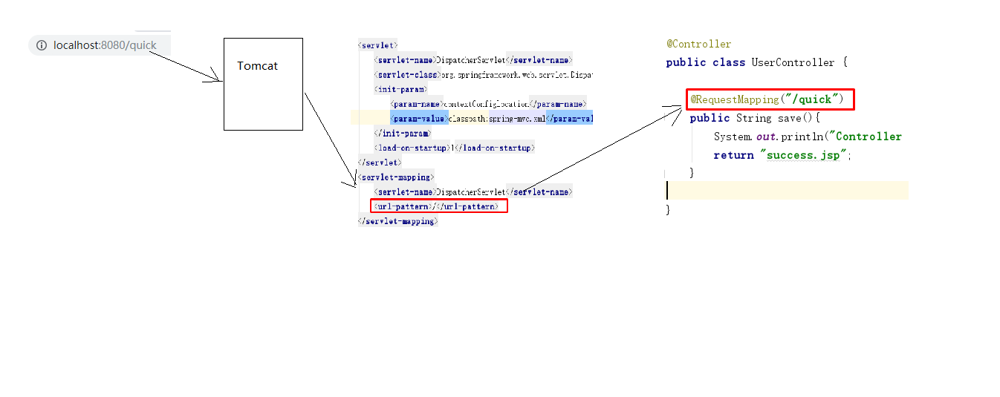
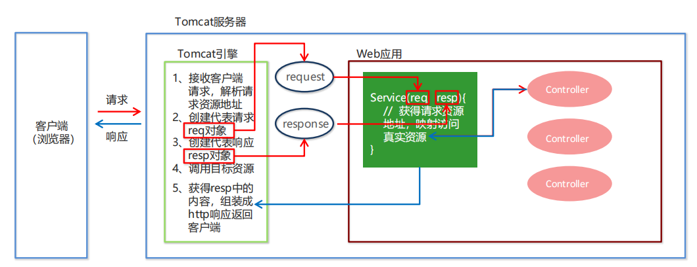
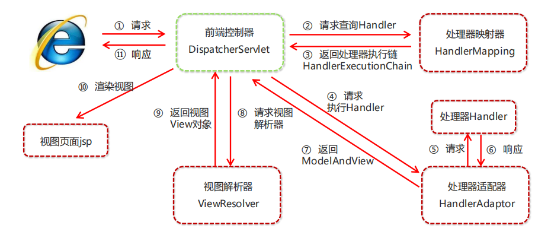
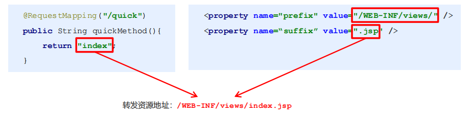
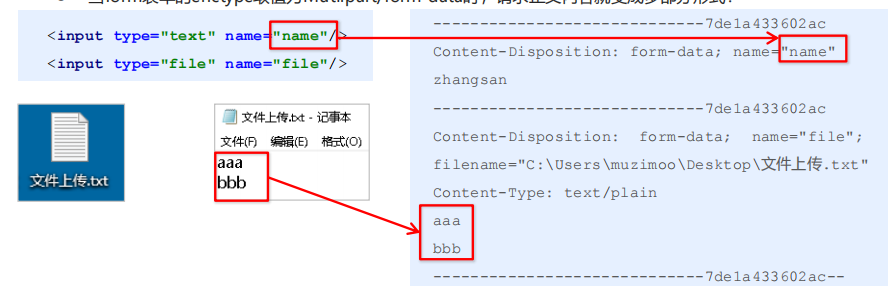

# Spring MVC
## 1.Spring 集成Web环境
### 1.1 ApplicationContext应用上下文获取方式
> 手动整合Spring集成Web环境

>创建Dao以及Servicec层，然后再创建web层的userController.java来调用Spring容器中的Service层对象,
>原始代码如下：

    public class UserController extends HttpServlet {
    
        @Override
        protected void doPost(HttpServletRequest req, HttpServletResponse resp) throws ServletException, IOException {
            /**
             * 获取Spring容器中的Bean
             */
            ApplicationContext app = new ClassPathXmlApplicationContext("applicationContext.xml");
            UserService userService = app.getBean(UserService.class);
            userService.save();
        }
    
        @Override
        protected void doGet(HttpServletRequest req, HttpServletResponse resp) throws ServletException, IOException {
            this.doPost(req,resp);
        }
    }

>如上所示，应用上下文对象是通过new ClasspathXmlApplicationContext(spring配置文件) 方式获取的，但是每次从
    容器中获得Bean时都要编写new ClasspathXmlApplicationContext(spring配置文件) ，这样的弊端是配置
    文件加载多次，应用上下文对象创建多次。

>在Web项目中，可以使用ServletContextListener监听Web应用的启动，我们可以在Web应用启动时，就加
载Spring的配置文件，创建应用上下文对象ApplicationContext，在将其存储到最大的域servletContext域
中，这样就可以在任意位置从域中获得应用上下文ApplicationContext对象了

### 1.2 Spring提供获取应用上下文的工具
> 上面的分析不用手动实现，Spring提供了一个监听器ContextLoaderListener就是对上述功能的封装，该监
  听器内部加载Spring配置文件，创建应用上下文对象，并存储到ServletContext域中，提供了一个客户端工
  具WebApplicationContextUtils供使用者获得应用上下文对象。
  

>所以我们需要做的只有两件事：         
  ① 在web.xml中配置ContextLoaderListener监听器（导入spring-web坐标）     
  ② 使用WebApplicationContextUtils获得应用上下文对象ApplicationContext         

### 1.3 导入Spring集成web的坐标

    <dependency> 
        <groupId>org.springframework</groupId> 
        <artifactId>spring-web</artifactId> 
        <version>5.0.5.RELEASE</version>
    </dependency>

### 1.4 配置ContextLoaderListener监听器
    <!--全局参数--> 
    <context-param> 
        <param-name>contextConfigLocation</param-name> 
        <param-value>classpath:applicationContext.xml</param-value>
    </context-param>
    
    <!--Spring的监听器--> 
    <listener> 
        <listener-class>
        org.springframework.web.context.ContextLoaderListener
        </listener-class>
    </listener>
    
### 1.5 通过工具获得应用上下文对象
    ApplicationContext applicationContext = 
    WebApplicationContextUtils.getWebApplicationContext(servletContext);
    Object obj = applicationContext.getBean("id");
    
### 1.5 知识要点
>   Spring集成web环境步骤     
    ① 配置ContextLoaderListener监听器        
    ② 使用WebApplicationContextUtils获得应用上下文       
    
## 2.Spring MVC简介
### 2.1 SpringMVC概述
>SpringMVC 是一种基于 Java 的实现 MVC 设计模型的请求驱动类型的轻量级 Web 框架，属于
SpringFrameWork 的后续产品，已经融合在 Spring Web Flow 中。

>SpringMVC 已经成为目前最主流的MVC框架之一，并且随着Spring3.0 的发布，全面超越 Struts2，成为最优
秀的 MVC 框架。它通过一套注解，让一个简单的 Java 类成为处理请求的控制器，而无须实现任何接口。同时
它还支持 RESTful 编程风格的请求。

>SpringMVC入门步骤

### 2.2 SpringMVC快速入门
> 需求：客户端发起请求，服务器端接收请求，执行逻辑并进行视图跳转。

>开发步骤：
 ① 导入SpringMVC相关坐标 

            <!--导入Spring依赖-->
            <dependency>
                <groupId>org.springframework</groupId>
                <artifactId>spring-context</artifactId>
                <version>5.3.9</version>
            </dependency>
            <dependency>
                <groupId>org.springframework</groupId>
                <artifactId>spring-web</artifactId>
                <version>5.3.9</version>
            </dependency>
            <dependency>
                <groupId>org.springframework</groupId>
                <artifactId>spring-test</artifactId>
                <version>5.3.9</version>
            </dependency>
    
            <!--导入spring-webmvc-->
            <dependency>
                <groupId>org.springframework</groupId>
                <artifactId>spring-webmvc</artifactId>
                <version>5.3.9</version>
            </dependency>
    
            <dependency>
                <groupId>javax.servlet</groupId>
                <artifactId>javax.servlet-api</artifactId>
                <version>4.0.1</version>
                <scope>provided</scope>
            </dependency>
    
            <dependency>
                <groupId>javax.servlet.jsp</groupId>
                <artifactId>javax.servlet.jsp-api</artifactId>
                <version>2.3.3</version>
                <scope>provided</scope>
            </dependency>   
 
>② 配置SpringMVC核心控制器DispathcerServlet        
         
         <!--配置SpringMVC的前端控制器-->
         <servlet>
             <servlet-name>DispatcherServlet</servlet-name>
             <servlet-class>org.springframework.web.servlet.DispatcherServlet</servlet-class>
             <init-param>
                 <param-name>contextConfigLocation</param-name>
                 <param-value>classpath:spring-mvc.xml</param-value>
             </init-param>
             <load-on-startup>1</load-on-startup>
         </servlet>
         <servlet-mapping>
             <servlet-name>DispatcherServlet</servlet-name>
             <url-pattern>/</url-pattern>
         </servlet-mapping>

>③ 创建Controller类和视图页面       
    
    @Controller
    //@RequestMapping("/user")
    public class UserController {
        /**
         * @RequestMapping("/quick"):
         * 作用：用于建立请求URL和处理方法之间的对应关系
         * 位置：
         *   类上：请求URL的第一季访问目录。此处不写的话，就相当于应用于根目录
         *   方法上：请求URL的第二级访问目录，与类上使用@RequestMapping标注的一级目录一起组成访问虚拟路径
         * 属性：
         *    value:用于指定请求的URL，他和path属性的作用是一样的
         *    method:用于指定请求的方法
         *    params:用于指定限制请求参数的条件。它支持简单的表达式。要求请求参数的key和value必须和配置一摸一样
         * @return
         */
        @RequestMapping("/quick")
        public String save(){
            System.out.println("controller save running...");
            return "/success.jsp";
        }
    }
    
    success.jsp
    <%@ page contentType="text/html;charset=UTF-8" language="java" %>
    <html>
    <head>
        <title>Title</title>
    </head>
    <body>
    <h1>Success! ${username}</h1>
    </body>
    </html>

>④ 使用注解配置Controller类中业务方法的映射地址      

        <!--配置Control组件扫描位置-->
        <context:component-scan base-package="com.lxg.spring_mvc2">
            <!--指定只扫描这个包下面有Controller注解的类-->
            <!--<context:include-filter type="annotation" expression="org.springframework.stereotype.Controller"/>
        -->
        </context:component-scan>
        
>⑤ 配置SpringMVC核心文件 spring-mvc.xml       

    <init-param>
        <!--在前端控制器中指定pring-mvc的配置文件的地址-->
        <param-name>contextConfigLocation</param-name>
        <param-value>classpath:spring-mvc.xml</param-value>
    </init-param>
    
>⑥ 客户端发起请求测试    
    
    启动程序，在浏览器输入htpp:localhost:8080/Spring_mvc/quick
    页面跳转到：success.jsp页面

### 2.3 SpringMVC流程图示

>代码角度

 
>业务角度

 
    
### 2.4 知识要点
>SpringMVC的开发步骤
① 导入SpringMVC相关坐标
② 配置SpringMVC核心控制器DispathcerServlet
③ 创建Controller类和视图页面
④ 使用注解配置Controller类中业务方法的映射地址
⑤ 配置SpringMVC核心文件 spring-mvc.xml
⑥ 客户端发起请求测试

## 3.Spring MVC 组件解析
### 3.1 SpringMVC的执行流程

>① 用户发送请求至前端控制器DispatcherServlet。       
>② DispatcherServlet收到请求调用HandlerMapping处理器映射器。     
>③ 处理器映射器找到具体的处理器(可以根据xml配置、注解进行查找)，生成处理器对象及处理器拦截器(如果有则生成)一并返回给DispatcherServlet。                 
>④ DispatcherServlet调用HandlerAdapter处理器适配器。                
>⑤ HandlerAdapter经过适配调用具体的处理器(Controller，也叫后端控制器)。      
>⑥ Controller执行完成返回ModelAndView。           
>⑦ HandlerAdapter将controller执行结果ModelAndView返回给DispatcherServlet。      
>⑧ DispatcherServlet将ModelAndView传给ViewReslover视图解析器。      
>⑨ ViewReslover解析后返回具体View。         
>⑩ DispatcherServlet根据View进行渲染视图（即将模型数据填充至视图中）。DispatcherServlet响应用户。

### 3.2 SpringMVC组件解析
1. 前端控制器：DispatcherServlet
>用户请求到达前端控制器，它就相当于 MVC 模式中的 C，DispatcherServlet 是整个流程控制的中心，由
它调用其它组件处理用户的请求，DispatcherServlet 的存在降低了组件之间的耦合性。

2. 处理器映射器：HandlerMapping
>HandlerMapping 负责根据用户请求找到 Handler 即处理器，SpringMVC 提供了不同的映射器实现不同的
映射方式，例如：配置文件方式，实现接口方式，注解方式等。

3. 处理器适配器：HandlerAdapter
>通过 HandlerAdapter 对处理器进行执行，这是适配器模式的应用，通过扩展适配器可以对更多类型的处理
器进行执行。

4. 处理器：Handler
>它就是我们开发中要编写的具体业务控制器。由 DispatcherServlet 把用户请求转发到 Handler。由
Handler 对具体的用户请求进行处理。

5. 视图解析器：View Resolver
>View Resolver 负责将处理结果生成 View 视图，View Resolver 首先根据逻辑视图名解析成物理视图名，即
具体的页面地址，再生成 View 视图对象，最后对 View 进行渲染将处理结果通过页面展示给用户。

6. 视图：View
>SpringMVC 框架提供了很多的 View 视图类型的支持，包括：jstlView、freemarkerView、pdfView等。最
常用的视图就是 jsp。一般情况下需要通过页面标签或页面模版技术将模型数据通过页面展示给用户，需要由程
序员根据业务需求开发具体的页面

### 3.3 SpringMVC注解解析
1. @RequestMapping
>作用：用于建立请求 URL 和处理请求方法之间的对应关系       
位置：     
 类上，请求URL 的第一级访问目录。此处不写的话，就相当于应用的根目录       
 方法上，请求 URL 的第二级访问目录，与类上的使用@ReqquestMapping标注的一级目录一起组成访问虚拟路径       
属性：     
 value：用于指定请求的URL。它和path属性的作用是一样的      
 method：用于指定请求的方式      
 params：用于指定限制请求参数的条件。它支持简单的表达式。要求请求参数的key和value必须和配置的一模一样     
例如：     
 params = {"accountName"}，表示请求参数必须有accountName     
 params = {"moeny!100"}，表示请求参数中money不能是100         

2. mvc命名空间引入
    
    命名空间：       
    xmlns:context="http://www.springframework.org/schema/context"       
    xmlns:mvc="http://www.springframework.org/schema/mvc"       
    约束地址：       
    http://www.springframework.org/schema/context       
    http://www.springframework.org/schema/context/spring-context.xsd        
    http://www.springframework.org/schema/mvc       
    http://www.springframework.org/schema/mvc/spring-mvc.xsd        
    
3. 组件扫描
>SpringMVC基于Spring容器，所以在进行SpringMVC操作时，需要将Controller存储到Spring容器中，
>如果使用@Controller注解标注的话，就需要使用
    <context:component-scan basepackage=“com.itheima.controller"/>     
>进行组件扫描。

### 3.4 SpringMVC的XML配置解析
1. 视图解析器
>SpringMVC有默认组件配置，默认组件都是DispatcherServlet.properties配置文件中配置的，该配置文件地址
org/springframework/web/servlet/DispatcherServlet.properties，该文件中配置了默认的视图解析器，如下：
org.springframework.web.servlet.ViewResolver=org.springframework.web.servlet.view.I
nternalResourceViewResolver

>翻看该解析器源码，可以看到该解析器的默认设置，如下：

    REDIRECT_URL_PREFIX = "redirect:" --重定向前缀
    FORWARD_URL_PREFIX = "forward:" --转发前缀（默认值）
    prefix = ""; --视图名称前缀
    suffix = ""; --视图名称后缀

>我们可以通过属性注入的方式修改视图的的前后缀
    
    <!--配置内部资源视图解析器--> 
    <bean class="org.springframework.web.servlet.view.InternalResourceViewResolver"> 
        <property name="prefix" value="/WEB-INF/views/"></property>
        <property name="suffix" value=".jsp"></property>
    </bean>

### 3.5 知识要点
>SpringMVC的相关组件
    • 前端控制器：DispatcherServlet
    • 处理器映射器：HandlerMapping
    • 处理器适配器：HandlerAdapter
    • 处理器：Handler
    • 视图解析器：View Resolver
    • 视图：View

>SpringMVC的注解和配置
     • 请求映射注解：@RequestMapping
     • 视图解析器配置：
     REDIRECT_URL_PREFIX = "redirect:" 
     FORWARD_URL_PREFIX = "forward:" 
     prefix = ""; 
     suffix = "";

## 4.Spring MVC的数据响应
### 4.1 SpringMVC的数据响应方式
1） 页面跳转     
 直接返回字符串       
 通过ModelAndView对象返回        

2） 回写数据     
 直接返回字符串       
 返回对象或集合    

### 4.2 页面跳转   
1.返回字符串形式    

>直接返回字符串：此种方式会将返回的字符串与视图解析器的前后缀拼接后跳转。

>返回带有前缀的字符串：        
转发：forward:/WEB-INF/views/index.jsp     
重定向：redirect:/index.jsp

2.返回ModelAndView对象
    
    @RequestMapping("/quick2")
        public ModelAndView save2(){
            /**
             * Model:模型。封装数据
             * View：视图，展示数据
             */
            ModelAndView modelAndView = new ModelAndView();
            //设置Model数据
            modelAndView.addObject("username","zhangsan");
            //设置视图名称
            modelAndView.setViewName("/success.jsp");
            return modelAndView;
        }

3.向request域存储数据
>在进行转发时，往往要向request域中存储数据，在jsp页面中显示，那么Controller中怎样向request
 域中存储数据呢？

>① 通过SpringMVC框架注入的request对象setAttribute()方法设置

        @RequestMapping("/quick5")
        public String save5(HttpServletRequest request){
            request.setAttribute("username","张三丰");
            return "success.jsp";
        }

>② 通过ModelAndView的addObject()方法设置

        @RequestMapping("/quick4")
        public String save4(Model model){
            model.addAttribute("username","wangwu");
            return "success.jsp";
        }
        
### 4.3 回写数据
1. 直接返回字符串
> Web基础阶段，客户端访问服务器端，如果想直接回写字符串作为响应体返回的话，只需要使用
  response.getWriter().print(“hello world”) 即可，那么在Controller中想直
  接回写字符串该怎样呢？

> ① 通过SpringMVC框架注入的response对象，使用response.getWriter().print(“hello world”) 回写数
  据，此时不需要视图跳转，业务方法返回值为void。

        @RequestMapping("/quick6")
        public void save6(HttpServletResponse response) throws IOException {
            response.getWriter().print("hello Spring MVC");
        }

> ② 将需要回写的字符串直接返回，但此时需要通过@ResponseBody注解告知SpringMVC框架，方法
  返回的字符串不是跳转是直接在http响应体中返回。

        @RequestMapping("/quick7")
        @ResponseBody //告知SpringMVC框架该方法不进行视图跳转，直接进行数据响应
        public String save7() {
            return "hello Spring MVC";
        }

>在异步项目中，客户端与服务器端往往要进行json格式字符串交互，此时我们可以手动拼接json字符串返回。

        @RequestMapping("/quick8")
        @ResponseBody //告知SpringMVC框架该方法不进行视图跳转，直接进行数据响应
        public String save8() {
            return "{\"username\":\"张三\",\"age\":18}";
        }

> 上述方式手动拼接json格式字符串的方式很麻烦，开发中往往要将复杂的java对象转换成json格式的字符串，
  我们可以使用json转换工具jackson进行转换，导入jackson坐标。

            <dependency>
                <groupId>com.fasterxml.jackson.core</groupId>
                <artifactId>jackson-core</artifactId>
                <version>2.12.4</version>
            </dependency>
            <dependency>
                <groupId>com.fasterxml.jackson.core</groupId>
                <artifactId>jackson-databind</artifactId>
                <version>2.12.4</version>
            </dependency>
            <dependency>
                <groupId>com.fasterxml.jackson.core</groupId>
                <artifactId>jackson-annotations</artifactId>
                <version>2.12.4</version>
            </dependency>

> 通过jackson转换json格式字符串，回写字符串。

        @RequestMapping("/quick9")
        @ResponseBody //告知SpringMVC框架该方法不进行视图跳转，直接进行数据响应
        public String save9() throws JsonProcessingException {
            User user = new User();
            user.setUsername("李四");
            user.setAge(20);
            //使用json的转换工具将对象转换成json格式字符串再返回
            ObjectMapper objectMapper = new ObjectMapper();
            String json = objectMapper.writeValueAsString(user);
            return json;
        }

2. 返回对象或集合
> 通过SpringMVC帮助我们对对象或集合进行json字符串的转换并回写，为处理器适配器配置消息转换参数，
  指定使用jackson进行对象或集合的转换，因此需要在spring-mvc.xml中进行如下配置：

         <!--配置处理器映射器-->
         <bean class="org.springframework.web.servlet.mvc.method.annotation.RequestMappingHandlerAdapter">
            <property name="messageConverters">
                <list>
                    <bean class="org.springframework.http.converter.json.MappingJackson2HttpMessageConverter"></bean>
                </list>
            </property>
        </bean>

> 在SpringMVC配置文件中配置好处理映射器后，就可以自动将返回对象转换成JSON格式得了

        @RequestMapping("/quick10")
        @ResponseBody //告知SpringMVC框架该方法不进行视图跳转，直接进行数据响应
        //期望SpringMVC自动将User转换成
        public User save10(){
            User user = new User();
            user.setUsername("李四");
            user.setAge(20);
            return user;
        }

> 在方法上添加@ResponseBody就可以返回json格式的字符串，但是这样配置比较麻烦，配置的代码比较多，
  因此，我们可以使用mvc的注解驱动代替上述配置。

    <!--配置Spring MVC注解驱动-->
        <mvc:annotation-driven></mvc:annotation-driven>
       
   > 在 SpringMVC 的各个组件中，处理器映射器、处理器适配器、视图解析器称为 SpringMVC 的三大组件。          
     使用<mvc:annotation-driven>自动加载 RequestMappingHandlerMapping（处理映射器）和
     RequestMappingHandlerAdapter（ 处 理 适 配 器 ），可用在Spring-xml.xml配置文件中使用
     <mvc:annotation-driven>替代注解处理器和适配器的配置。
     同时使用<mvc:annotation-driven>默认底层就会集成jackson进行对象或集合的json格式字符串的转换。

### 4.4 知识要点
> SpringMVC的数据响应方式      
1） 页面跳转     
 直接返回字符串       
 通过ModelAndView对象返回        
2） 回写数据     
 直接返回字符串       
 返回对象或集合       

## 5.Spring MVC获得请求数据
### 5.1 获得请求参数
>客户端请求参数的格式是：name=value&name=value....
>服务器端要获得请求的参数，有时还需要进行数据封装，SpringMVC可以接收如下的数据类型
> - 基本数据类型
> - POJO类型参数
> - 数组类型参数
> - 集合类型参数 

### 5.2 获得基本类型参数
> Controller中的业务方法的参数名称要与请求参数的name一致，参数值会自动映射匹配。  
> http://localhost:8080/Spring_mvc/quick11?username=zhangsan&age=12   
>启动服务，在浏览器地址栏输入上面地址，则在下列方法中会接收到username和age的参数值    

        /**
         * 获得简单类型参数
         * @param username
         * @param age
         */
        @RequestMapping("/quick11")
        @ResponseBody //告知SpringMVC框架该方法不进行视图跳转，直接进行数据响应
        public void save11(String username,int age){
            System.out.println(username);
            System.out.println(age);
        }

### 5.3 获得POJO类型参数
> Controller中的业务方法的POJO参数的属性名与请求参数的name一致，参数值会自动映射匹配。

> http://localhost:8080/Spring_mvc/quick12?username=zhangsan&age=12

>POJO

    public class User {
        private String username;
        private int age;
    
        public String getUsername() {
            return username;
        }
    
        public void setUsername(String username) {
            this.username = username;
        }
    
        public int getAge() {
            return age;
        }
    
        public void setAge(int age) {
            this.age = age;
        }
    
        @Override
        public String toString() {
            return "User{" +
                    "username='" + username + '\'' +
                    ", age=" + age +
                    '}';
        }
    }

> Controller
        
        /**
         * 获得POJO类型参数
         * Controller中业务方法的POJO参数的属性与请求参数的name一致，参数值会被自动映射
         */
        @RequestMapping("/quick12")
        @ResponseBody //告知SpringMVC框架该方法不进行视图跳转，直接进行数据响应
        public void save12(User user){
            
            System.out.println(user);
        }

### 5.4 获得数组类型参数
> Controller中的业务方法数组名称与请求参数的name一致，参数值会自动映射匹配。

        /**
         * 获得数组类型参数
         * Controller中业务方法的数组名称与请求参数的name一致，参数值会被自动映射
         * http://localhost:8080/Spring_mvc/quick13?strs=111&strs=222&strs=333
         */
        @RequestMapping("quick13")
        @ResponseBody
        public void save13(String[] strs){
            
            System.out.println(Arrays.asList(strs));
        }

### 5.5 获得集合类型参数
> 获得集合参数时，要将集合参数包装到一个POJO中才可以。

> 编写页面表单

        <form action="${pageContext.request.contextPath}/quick14" method="post">
            <%--第一个对象--%>
            <input type="text" name="userList[0].username"> 
            <input type="text" name="userList[0].age"> 
            <input type="text" name="userList[1].username"> 
            <input type="text" name="userList[1].age"> 
            <input type="submit" value="提交">
        </form>

> Controller层

        /**
         * 获得集合类型参数
         * 获得集合参数时，要将集合参数包装到一个POJO中才可以
         * 此处当传递的参数是一个User类型的集合时，与VO类的属性一致，参数值会被自动映射
         */
        @RequestMapping("/quick14")
        @ResponseBody
        public void save14(VO vo){
            
            System.out.println(vo);
        }

> 在COntroler层接收到的集合类型参数，需要封装到一个POJO中，才能接收得到
>封装的POJO

    public class VO {
    
        //将集合作为属性，封装到POJO里面
        private List<User> userList;
    
        public List<User> getUserList() {
            return userList;
        }
    
        public void setUserList(List<User> userList) {
            this.userList = userList;
        }
    
        @Override
        public String toString() {
            return "VO{" +
                    "userList=" + userList +
                    '}';
        }
    }

> 当使用ajax提交时，可以指定contentType为json形式，那么在方法参数位置使用@RequestBody可以
  直接接收集合数据而无需使用POJO进行包装。

        

        /**
         * 获得集合类型参数
         * 当使用ajax提交时，可以指定contentType为json形式，那么再方法参数位置使用@RequestBody可以
         * 直接接收集合数据而无需使用pojo进行包装
         */
        @RequestMapping("/quick15")
        @ResponseBody
        public void save15(@RequestBody List<User> userList){
            System.out.println(userList);
            System.out.println("quick15");
        }

> 注意：通过谷歌开发者工具抓包发现，没有加载到jquery文件，原因是SpringMVC的前端控制器
  DispatcherServlet的url-pattern配置的是/,代表对所有的资源都进行过滤操作，我们可以通过以下两种
  方式指定放行静态资源：
  
      • 在spring-mvc.xml配置文件中指定放行的资源
      <mvc:resources mapping="/js/**" location="/js/"/> 
      • 使用<mvc:default-servlet-handler/>标签

> 当post请求时，数据会出现乱码，我们可以设置一个过滤器来进行编码的过滤。

        <!--
        当POST请求时，数据会出现乱码，可以设置一个过滤器来进行编码的过滤
        -->
        <!--配置全局过滤的filter-->
        <filter>
            <filter-name>CharacterEncodingFilter</filter-name>
            <filter-class>org.springframework.web.filter.CharacterEncodingFilter</filter-class>
            <init-param>
                <param-name>encoding</param-name>
                <param-value>UTF-8</param-value>
            </init-param>
        </filter>
        <filter-mapping>
            <filter-name>CharacterEncodingFilter</filter-name>
            <url-pattern>/*</url-pattern>
        </filter-mapping>

### 5.7 参数绑定注解@requestParam
> 当请求的参数名称与Controller的业务方法参数名称不一致时，就需要通过@RequestParam注解显示的绑定。

        <form action="${pageContext.request.contextPath}/quick16" method="post">
            姓名：<input type="text" name="name"> 
            <input type="submit" value="提交">
        </form>
        
        /**
         * 当请求的参数名称与Controller的业务方法参数名称不一致时，
         * 就需要通过@RequestParam注解显示的绑定。
         * @param username
         */
        @RequestMapping("/quick16")
        @ResponseBody
        public void save16(@RequestParam("name") String username){
            System.out.println(username);
        }
> 注解@RequestParam还有如下参数可以使用：        
   value：与请求参数名称       
   required：此在指定的请求参数是否必须包括，默认是true，提交时如果没有此参数则报错      
   defaultValue：当没有指定请求参数时，则使用指定的默认值赋值         

        /**
         * 可以配置不用必须传递参数
         * 和设置默认值，如果没有传递参数，则使用默认值
         * @param username
         */
        @RequestMapping("/quick17")
        @ResponseBody
        public void save17(@RequestParam(value = "name",required = false,defaultValue = "李四") String username){
            System.out.println(username);
        }
        
### 5.8 获得Restful风格的参数
> Restful是一种软件架构风格、设计风格，而不是标准，只是提供了一组设计原则和约束条件。主要用于客户端和服务
  器交互类的软件，基于这个风格设计的软件可以更简洁，更有层次，更易于实现缓存机制等。
  Restful风格的请求是使用“url+请求方式”表示一次请求目的的，HTTP 协议里面四个表示操作方式的动词如下：        
   GET：用于获取资源      
   POST：用于新建资源     
   PUT：用于更新资源      
   DELETE：用于删除资源       
  例如：       
   /user/1 GET ： 得到 id = 1 的 user      
   /user/1 DELETE： 删除 id = 1 的 user        
   /user/1 PUT： 更新 id = 1 的 user           
   /user POST： 新增 user         

>上述url地址/user/1中的1就是要获得的请求参数，在SpringMVC中可以使用占位符进行参数绑定。地址/user/1可以写成
 /user/{id}，占位符{id}对应的就是1的值。在业务方法中我们可以使用@PathVariable注解进行占位符的匹配获取工作。

        /**
         * 在SpringMVC中可以使用占位符进行参数绑定。地址/user/1可以写成
         * /user/{id}，占位符{id}对应的就是1的值。在业务方法中我们可以使
         * 用@PathVariable注解进行占位符的匹配获取工作。
         * @param username
         */
        @RequestMapping("/quick18/{name}")
        @ResponseBody
        public void save18(@PathVariable(value = "name",required = true) String username){
            System.out.println(username);
        }
        
### 5.9 自定义类型转换器
- SpringMVC 默认已经提供了一些常用的类型转换器，例如客户端提交的字符串转换成int型进行参数设置。
- 但是不是所有的数据类型都提供了转换器，没有提供的就需要自定义转换器，例如：日期类型的数据就需要自
定义转换器。

>自定义类型转换器的开发步骤：     
① 定义转换器类实现Converter接口
    
    public class DateConverter  implements Coverter<String, Date>{
        @Override
        public Date convert(String source) {
            SimpleDateFormat format = new SimpleDateFormat("yyyy-MM-dd");
            try {
                Date date = format.parse(source);
                return date;
            } catch (ParseException e) {
                e.printStackTrace();
            }
            return null; }
    }

       
>② 在配置文件中声明转换器  
 
    <bean id="converterService" 
    class="org.springframework.context.support.ConversionServiceFactoryBean"> <property name="converters"> <list><bean class="com.itheima.converter.DateConverter"/>
    </list>
    </property>
    </bean>
         
> ③ 在<annotation-driven>中引用转换器 

    <mvc:annotation-driven conversion-service="converterService"/>

### 5.10 获得Servlet相关API 
> SpringMVC支持使用原始ServletAPI对象作为控制器方法的参数进行注入，常用的对象如下：        
   HttpServletRequest      
   HttpServletResponse     
   HttpSession     

        /**
         * SpringMVC支持使用原始ServletAPI对象作为控制器方法的参数进行注入，
         * @param httpRequest
         * @param httpResponse
         * @param httpSession
         */
        @RequestMapping("/quick19")
        @ResponseBody
        public void save19(HttpRequest httpRequest, HttpResponse httpResponse, HttpSession httpSession){
            System.out.println(httpRequest);
            System.out.println(httpResponse);
            System.out.println(httpSession);
        }
 
### 5.11 获得请求头 
> 1.@RequestHeader   
>使用@RequestHeader可以获得请求头信息，相当于web阶段学习的request.getHeader(name)
@RequestHeader注解的属性如下：      
 value：请求头的名称      
 required：是否必须携带此请求头       

        @RequestMapping("/quick20")
        @ResponseBody
        public void save20(
                @RequestHeader(value = "User-Agent",required = false) String
                        headerValue){
            System.out.println(headerValue);
        } 
        
 
 > 2.@CookieValue       
   使用@CookieValue可以获得指定Cookie的值     
   @CookieValue注解的属性如下：     
    value：指定cookie的名称      
    required：是否必须携带此cookie         

        @RequestMapping("/quick21")
        @ResponseBody
        public void save21(
                @CookieValue(value = "JSESSIONID",required = false) String jsessionid){
            System.out.println(jsessionid);
        }
        
### 5.12 文件上传
>1. 文件上传客户端三要素      
 表单项type=“file”        
 表单的提交方式是post      
 表单的enctype属性是多部分表单形式，及enctype=“multipart/form-data”       

        <form action="${pageContext.request.contextPath}/quick22" method="post" enctype="multipart/form-data">
            名称:<input type="text" name="username"> 
            文件:<input type="file" name="upload"> 
            <input type="submit" value="提交">
        </form>
    
> 2. 文件上传原理         
   当form表单修改为多部分表单时，request.getParameter()将失效。     
   enctype=“application/x-www-form-urlencoded”时，form表单的正文内容格式是：        
  key=value&key=value&key=value     
   当form表单的enctype取值为Mutilpart/form-data时，请求正文内容就变成多部分形式：      

### 5.13 单文件上传步骤
>① 导入fileupload和io坐标

            <!--导入文件上传需要的依赖-->
            <dependency>
                <groupId>commons-fileupload</groupId>
                <artifactId>commons-fileupload</artifactId>
                <version>1.4</version>
            </dependency>
            <dependency>
                <groupId>commons-io</groupId>
                <artifactId>commons-io</artifactId>
                <version>2.6</version>
            </dependency>

>② 配置文件上传解析器

        <!--配置文件上传解析器-->
        <bean id="multipartResolver" class="org.springframework.web.multipart.commons.CommonsMultipartResolver">
            
            <!--上传文件总大小-->
            <property name="maxUploadSize" value="5242800"></property>
            
            <!--上传单个文件的大小-->
            <property name="maxUploadSizePerFile" value="5242800"></property>
            
            <!--上传文件的编码类型-->
            <property name="defaultEncoding" value="UTF-8"></property>
        </bean>
        
>③ 编写文件上传代码
    
        /**
         * 接收单文件上传文件
         */
        @RequestMapping("/quick22")
        @ResponseBody
        public void save22(String name, MultipartFile uploadFile) throws IOException {
            //获得文件名称
            String originalFilename = uploadFile.getOriginalFilename();
            
            //保存文件
            uploadFile.transferTo(new File("c:\\upload\\"+originalFilename));
        }

### 5.15 多文件上传实现
>多文件上传，只需要将页面修改为多个文件上传项，将方法参
>数MultipartFile类型修改为MultipartFile[]即可

        <%--多文件上传--%>
        <form action="${pageContext.request.contextPath}/quick23" method="post" enctype="multipart/form-data">
            名称:<input type="text" name="username"> 
            文件1:<input type="file" name="upload"> 
            文件2:<input type="file" name="upload"> 
            文件3:<input type="file" name="upload"> 
            文件4:<input type="file" name="upload"> 
            <input type="submit" value="提交">
        </form>
        
        
            /**
             * 接收多文件上传文件
             */
            @RequestMapping("/quick23")
            @ResponseBody
            public void save23(String username, MultipartFile[] upload) throws IOException {
                for (MultipartFile file : upload) {
                    String filename = file.getOriginalFilename();
                    System.out.println(filename);
                } 
            }

### 5.16 知识要点

>MVC实现数据请求方式        
 基本类型参数        
 POJO类型参数      
 数组类型参数        
 集合类型参数        

>MVC获取数据细节      
 中文乱码问题        
 @RequestParam 和 @PathVariable     
 自定义类型转换器      
 获得Servlet相关API        
 @RequestHeader 和 @CookieValue     
 文件上传      

## 6.Spring MVC拦截器
## 7.Spring MVC异常处理

