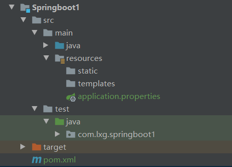

# Spring Boot

## 简介
>spring boot 它的设计目的就是为例简化开发，开启了各种自动装
>配，你不想写各种配置文件，引入相关的依赖就能迅速搭建起一个web
>工程。它采用的是建立生产就绪的应用程序观点，优先于配置的惯例。

>可能你有很多理由不放弃SSM,SSH，但是当你一旦使用了springboot ,
>你会觉得一切变得简单了，配置变的简单了、编码变的简单了，部署变的简单了，
>感觉自己健步如飞，开发速度大大提高了。就好比，当你用了IDEA，你会觉得再也
>回不到Eclipse时代一样。

## 建构工程

> 打开Idea-> new Project ->Spring Initializr ->填写group、artifact ->钩上web(开启web功能）
> ->点下一步就行了。

## 工程目录

> pom文件为基本的依赖管理文件       
  resouces 资源文件     
  statics 静态资源      
  templates 模板资源        
  application.yml 配置文件          
  SpringbootApplication程序的入口。       

> pom.xml       
>其中spring-boot-starter-web不仅包含spring-boot-starter,还自动开启了web功能。

    <?xml version="1.0" encoding="UTF-8"?>
    <project xmlns="http://maven.apache.org/POM/4.0.0" xmlns:xsi="http://www.w3.org/2001/XMLSchema-instance"
             xsi:schemaLocation="http://maven.apache.org/POM/4.0.0 https://maven.apache.org/xsd/maven-4.0.0.xsd">
        <modelVersion>4.0.0</modelVersion>
        <parent>
            <groupId>org.springframework.boot</groupId>
            <artifactId>spring-boot-starter-parent</artifactId>
            <version>2.5.5</version>
            <relativePath/> <!-- lookup parent from repository -->
        </parent>
        <groupId>com.lxg</groupId>
        <artifactId>springboot1</artifactId>
        <version>0.0.1-SNAPSHOT</version>
        <name>springboot1</name>
        <description>Demo project for Spring Boot</description>
        <properties>
            <java.version>1.8</java.version>
        </properties>
        <dependencies>
            <dependency>
                <groupId>org.springframework.boot</groupId>
                <artifactId>spring-boot-starter-web</artifactId>
            </dependency>
    
            <dependency>
                <groupId>org.springframework.boot</groupId>
                <artifactId>spring-boot-starter-test</artifactId>
                <scope>test</scope>
            </dependency>
        </dependencies>
    
    
        <build>
            <plugins>
                <plugin>
                    <groupId>org.springframework.boot</groupId>
                    <artifactId>spring-boot-maven-plugin</artifactId>
                </plugin>
            </plugins>
        </build>
    
    </project>

## 功能演示
>举个栗子，比如你引入了Thymeleaf的依赖，spring boot 就会自动帮你引入SpringTemplateEngine，当你引入了自己的SpringTemplateEngine，
>spring boot就不会帮你引入。它让你专注于你的自己的业务开发，而不是各种配置。

> 创建一个Controller

    @RestController
    //@Controller 这两个注解都可以使用
    public class HelloController {
    
        @RequestMapping("/hello")
        @ResponseBody //标志只返回数据，不跳转页面
        public String hello(){
            return "hello";
        }
    }

> 启动SpringbootFirstApplication的main方法，
>打开浏览器localhost:8080/hello,浏览器显示：
> hello

## 神奇之处
- 你没有做任何的web.xml配置。
- 你没有做任何的sping mvc的配置; springboot为你做了。
- 你没有配置tomcat ;springboot内嵌tomcat.

## 启动springboot 方式

- cd到项目主目录:
> mvn clean  
  mvn package  编译项目的jar     
  mvn spring-boot: run 启动
  cd 到target目录，java -jar 项目.jar

